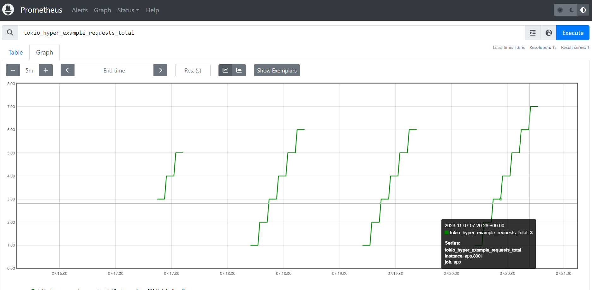

# monotonicity demo

## Context
Run the docker compose demo with prometheus and an app to increment a counter.

Every 5s (prometheus scrap interval) , the metric is scrapped and a counter increases by 1 every time.

Every 30s, the app is stopped for 30s and restart.

The counter increases by 6 per minute which is (30s / 5s) and the rate should be closed to 0.1rps (6/60s).

This demo emphasises the restart and state management issue on pull + cumulative based metrics.

```bash
./run.sh
```

The prometheus graphs which includes instant vector

open in a brower [grafana graphs](http://localhost:3000/d/f121c72d-d858-44bc-9a1e-adf869509b38/monotonicity?orgId=1)

## Prometheus Queries

Using rates is the best way to properly view metrics on cumulative/pull based metrics model.

### Instant Vector
As soon as the app restarts, the counter is discontinue and no more monotonic


### Range Vector increase
Viewing a 1mn range of the metrics is better but the counter looks weird 


### Range Vector rate
The metrics is close to the expected 0.1rps but still rounded due to the number of restart


## Grafana queries

long term integral can be used as opposed to prometheus which is [not solved](https://github.com/prometheus/prometheus/issues/1335) and not the right tool to do it, it is perfectly documented on [prometheus](https://prometheus.io/docs/introduction/comparison/#summary) which is a good sign of maturity and trade-offs

TODO victoria metrics and MetricsQL (integrate) + Mimir