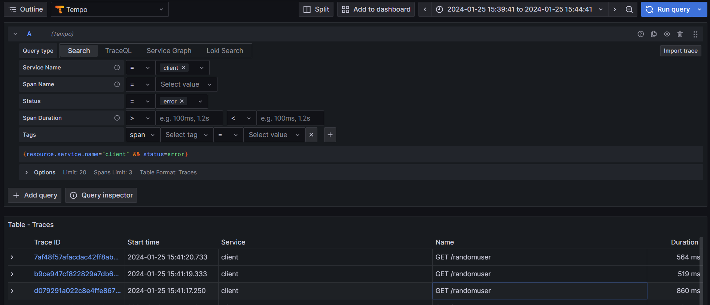
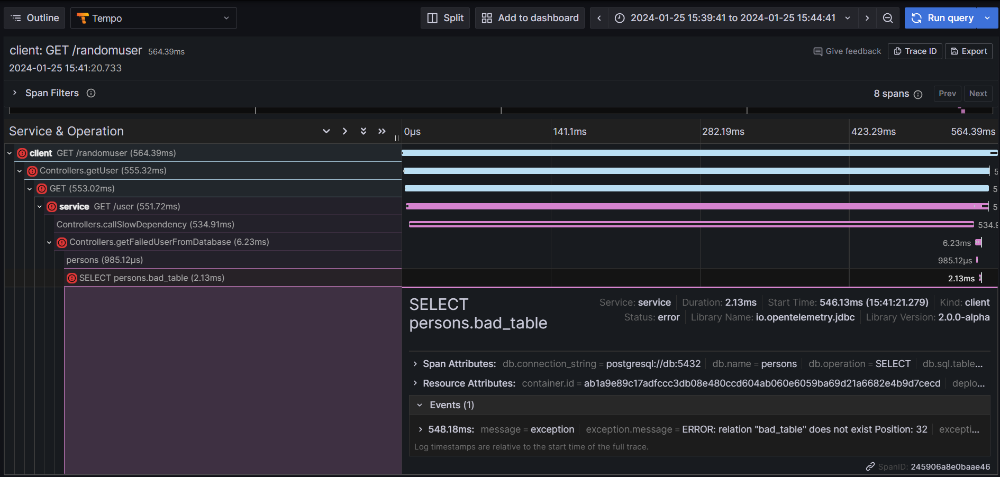

# 2024-01-31 #9 OpenTelemetry Looks Good To Me

LGTM are a GrafanaLabs products initials and a joke for Loki, Grafana, Tempo and Mimir which have been used in this [demo](./demo/README.md).

[OpenTelemetry](../2023-11-30_What_is_OpenTelemetry/README.md) becomes standard and really useful to solve common problems in observability.

[Dedicated post for the docker compose GrafanaLabs LGTM for java with OpenTelemetry demo](./demo/README.md)

<iframe src="https://www.youtube.com/embed/1kgAzLYeKGY?si=dsrZowTsOmSJ1tsj" title="OpenTelemetry LGTM demo" frameborder="0" allow="accelerometer; autoplay; clipboard-write; encrypted-media; gyroscope; picture-in-picture; web-share" allowfullscreen></iframe>

## Naming conventions
References: https://opentelemetry.io/docs/concepts/semantic-conventions/

Without naming and value conventions, correlating signals can become quickly a nightmare, to solve that issue, [OpenTelemetry Semantic Conventions](https://opentelemetry.io/docs/concepts/semantic-conventions/) concept is really good to start and integrate.

In the following [demo](./demo/README.md), [resources](https://opentelemetry.io/docs/specs/semconv/resource/) have been defined to have such attributes for all signals to query/correlated telemetry for those dimensions.

| Resource Attribute | Value |
|-|-|
|service.name| the application name |
|service.namespace| namespace to group multiple service [Bounded context](https://martinfowler.com/bliki/BoundedContext.html) |
|service.version| version of the service |
|host.name | hostname |
|deployment.environment | the environment where the application runs (dev,test,prod, ...) |

As an example, by clicking on errors, it can be easy to get corresponding traces:

## Traces Sampling: Head vs Tail sampling
This demo uses tail sampling introduced during the last [Tail sampling post](../2023-11-30_What_is_OpenTelemetry/README.md#tail-sampling).

By default, head sampling is used to decided the percentage of the traffic that should be traced.
Parent based head sampling is commonly used to avoid truncated spans but can become inefficient to optimize p99 requests. 

While starting with head sampling can be done easily with good results, tracking p99 optimization can be hard since it really depends of the ratio and the probability to get the full trace. When the ratio is close to 100%, it means that almost all the traces end to the traces backend and come at cost.

No sampling is just a waste of resource since only errors and latencies are important.

Tail sampling has been setup with [opentelemetry collector contrib](https://github.com/open-telemetry/opentelemetry-collector-contrib) in this [demo](./demo/otelcontribcol/pipeline.gateway.yml). 

Again, when tracing error, it become important to avoid tracing 4XX errors when it is not useful or important.

Pay close attention that introducing a [Gateway](https://opentelemetry.io/docs/collector/deployment/gateway/) comes with [trade-offs](https://opentelemetry.io/docs/collector/deployment/gateway/#tradeoffs).

Temporary putting the sampling at 100% if it does not impact the bill or the observability backend is just ok.

## Instrumentations
A dedicated [post section](../2023-11-30_What_is_OpenTelemetry/README.md#instrumentation) has been introduced during the [last post](../2023-11-30_What_is_OpenTelemetry/README.md#instrumentation).

Having a telemetry backends is not the only one requirement to support observability: instrumentations are really important to get telemetry metrics, logs and traces.

Having standard instrumentation really helps opensource projects to give a fully integrated service including observability and monitoring.

As opposed, having too much telemetry can be costly and it becomes important to choose carefully instrumented middleware when using [automatic instrumentation](../2023-11-30_What_is_OpenTelemetry/README.md#automatic)

## Collectors
References: https://opentelemetry.io/docs/collector/deployment/

OpenTelemetry offers different ways to integrate a collector. The official [OpenTelemetry Collector](https://github.com/open-telemetry/opentelemetry-collector) can be forked or partially used to build a different one like the [Grafana Agent](https://grafana.com/docs/agent/latest/) or simply enhanced like [OpenTelemetry Collector Contrib](https://github.com/open-telemetry/opentelemetry-collector-contrib) which has been used during the [demo](./demo/README.md).

SDKs also offers exporters which is the [No Collector](https://opentelemetry.io/docs/collector/deployment/no-collector/) mode.

3 different ways are available to deploy a collector: [No Collector](https://opentelemetry.io/docs/collector/deployment/no-collector/), [Agent](https://opentelemetry.io/docs/collector/deployment/agent/), [Gateway](https://opentelemetry.io/docs/collector/deployment/gateway/).

All this deployments are used in the [demo](./demo/README.md).

The [Agent](https://opentelemetry.io/docs/collector/deployment/agent/) is quite common and used to scrap telemetry like prometheus, filelog, ...

The [No Collector](https://opentelemetry.io/docs/collector/deployment/no-collector/) can help to support observability in short lived tasks (like Function As A Service, ...) while [Gateway](https://opentelemetry.io/docs/collector/deployment/gateway/) can help to introduce [Tail Sampling](./README.md#traces-sampling-head-vs-tail-sampling) and avoid loosing telemetry data when [No Collector](https://opentelemetry.io/docs/collector/deployment/no-collector/) is used.

The agent monitoring is also important, the gateway has been instrumented and dashboard has also been provisionned in the [demo](./demo/README.md)

As mentioned before, it all about trade-offs.

### Trade-offs

||Pros|Cons|
|-|-|-|
| [No Collector](https://opentelemetry.io/docs/collector/deployment/no-collector/#tradeoffs) |+ Simple to use (especially in a dev/test environment) + No additional moving parts to operate (in production environments)|- Requires code changes if collection, processing, or ingestion changes - Strong coupling between the application code and the backend - There are limited number of exporters per language implementation|
| [Agent](https://opentelemetry.io/docs/collector/deployment/agent/#tradeoffs) |+ Simple to get started + Clear 1:1 mapping between application and collector |- Scalability (human and load-wise) - Inflexible |
| [Gateway](https://opentelemetry.io/docs/collector/deployment/gateway/#tradeoffs) | + Separation of concerns such as centrally managed credentials + Centralized policy management (for example, filtering certain logs or sampling) | - It’s one more thing to maintain and that can fail (complexity)  - Added latency in case of cascaded collectors  - Higher overall resource usage (costs) | 

### Short lived task
While [Agent](https://opentelemetry.io/docs/collector/deployment/agent/) mode is the most used to start, it becomes complex to use this mode with short lived task like Function as a service or scheduled task since the telemetry might not be exported after the graceful shutdown.

For this purpose, maintaining an Agent or a [Gateway](https://opentelemetry.io/docs/collector/deployment/gateway/) is quite the same and less complex.

This is why, in such cases, using OTLP really helps to avoid using an [Agent](https://opentelemetry.io/docs/collector/deployment/agent/) but instead, pushing the telemetry to a backend (a [Gateway](https://opentelemetry.io/docs/collector/deployment/gateway/)) co-located with the short lived tasks. 

### Scaling Collectors
Reference: https://opentelemetry.io/docs/collector/scaling/

Monitoring collectors is really important to avoid [out of control agent antipattern](../2023-10-18_What_is_not_an_observability_solution/What_is_not_an_o11y_solution.md#out-of-control-collector).

Without agent monitoring, it becomes complex to scale and understand the volumes and problems.

OpenTelemetry Collectors combined with Mimir is a good choice to monitor all agents and gateway to be sure that everything is working correctly or need scaling.

[This dashboard](https://grafana.com/grafana/dashboards/15983-opentelemetry-collector/) from MonitoringArtist has been used and updated.

## Telemetry Queries
Having well instrumented middlewares/libraries available without a proper/common way to query and build dashboard is annoying.

This is why Grafana Labs comes in to play and has been smart to integrate Mimir (Previously Cortex) compatible with [Graphite](../2023-12-07_Meet_Graphite/README.md) and [PromQL](https://prometheus.io/docs/prometheus/latest/querying/basics/).

Grafana Labs push really hard to integrate PromQL like query models inside their products like Loki (LogQL) and Tempo (TraceQL).

## Dashboard templates
What a nightmare to monitor same kind of application but with different ways and tools. At some point, when using micro services at scale, it becomes important to have the same approach for the same problems. Building dashboard templates increase the productivity and the Grafana Labs dashboard is a good place to share them.

Along the [demo](./demo/README.md), 3 dashboards have been published to Grafana Labs dashboard:
- https://grafana.com/grafana/dashboards/20352-opentelemetry-jvm-micrometer/
- https://grafana.com/grafana/dashboards/20353-opentelemetry-jvm-micrometer-per-instance/
- https://grafana.com/grafana/dashboards/20376-opentelemetry-collector-hostmetrics-node-exporter/

[Those dashboard are provisionned](./demo/grafana/provisioning/dashboards/) in the [demo](./demo/README.md).

One more dashboard has been used to monitor OpenTelemetry Collectors:
https://grafana.com/grafana/dashboards/15983-opentelemetry-collector/

## What if everything goes wrong ?

### Error and latencies impact on observability platform
An old topic regarding the true cost of errors (logs and traces).
Without a proper sampling management, observability backend can be hammered in case of errors and/or latencies.

Example: everything is failling and all the traces end in the backend.

Solution: 
- Reduce the ratio but it can be annoying to redeploy everything during an outage.
- Use collector probabilistic tail sampling [Gateway](https://opentelemetry.io/docs/collector/deployment/gateway/) on outage if needed and monitor agents/gateway properly thanks to Grafana dashboards and Mimir.

## Sidenotes
### OTEL > LOKI labels mapping
References: https://github.com/grafana/loki/blob/main/docs/sources/send-data/otel/_index.md

OTLP support from loki is quite recent, during the demo, the service.version label is skipped according to this [allow listed labels](https://github.com/grafana/loki/issues/11786)

