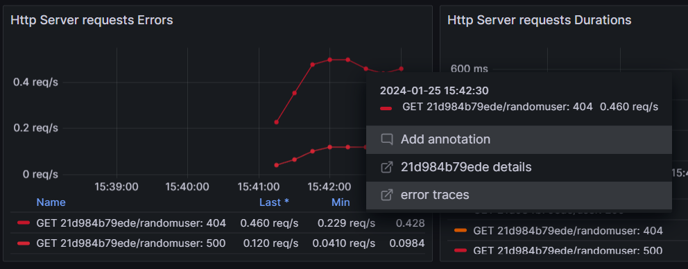

# OpenTelemetry Looks Good To Me

LGTM are a GrafanaLabs products initials and a joke for Loki, Grafana, Tempo and Mimir which have been used in this [demo](./demo/README.md).

[OpenTelemetry](../2023-11-30_What_is_OpenTelemetry/README.md) becomes standard and really useful to solve common problems in observability.

[Dedicated post for the docker compose GrafanaLabs LGTM for java with OpenTelemetry demo](./demo/README.md)

## Naming conventions
References: https://opentelemetry.io/docs/concepts/semantic-conventions/

Without naming and value conventions, correlating signals can become quickly a nightmare, to solve that issue, [OpenTelemetry Semantic Conventions](https://opentelemetry.io/docs/concepts/semantic-conventions/) concept is really good to start and integrate.

In the following [demo](./demo/README.md), [resources](https://opentelemetry.io/docs/specs/semconv/resource/) have been defined to have such attributes for all signals to query/correlated telemetry for those dimensions.

| Resource Attribute | Value |
|-|-|
|service.name| the application name |
|service.namespace| namespace to group multiple service [Bounded context](https://martinfowler.com/bliki/BoundedContext.html) |
|service.version| version of the service |
|host.name | hostname |
|deployment.environment | the environment where the application runs (dev,test,prod, ...) |

As an example, by clicking on errors, it can be easy to get corresponding traces:

## Traces Sampling: Head vs Tail sampling
This demo uses tail sampling introduced during the last [Tail sampling post](../2023-11-30_What_is_OpenTelemetry/README.md#tail-sampling).

By default, head sampling is used to decided the percentage of the traffic that should be traced.
Parent based head sampling is commonly used to avoid truncated spans but can become inefficient to optimize p99 requests. 

While starting with head sampling can be done easily with good results, tracking p99 optimization can be hard since it really depends of the ratio and the probability to get the full trace. When the ratio is close to 100%, it means that almost all the traces end to the traces backend and come at cost.

No sampling is just a waste of resource since only errors and latencies are important.

Tail sampling has been setup with [opentelemetry collector contrib](https://github.com/open-telemetry/opentelemetry-collector-contrib) in this [demo](./demo/otelcontribcol/pipeline.gateway.yml).

Again, when tracing error, it become important to avoid tracing 4XX errors when it is not useful or important.

## Instrumentations
A dedicated [post section](../2023-11-30_What_is_OpenTelemetry/README.md#instrumentation) has been introduced during the [last post](../2023-11-30_What_is_OpenTelemetry/README.md#instrumentation).

Having a telemetry backends is not the only one requirement to support observability: instrumentations are really important to get telemetry metrics, logs and traces.

Having standard instrumentation really helps opensource projects to give a fully integrated service including observability and monitoring.

As opposed, having too much telemetry can be costly and it becomes important to choose carefully instrumented middleware when using [automatic instrumentation](../2023-11-30_What_is_OpenTelemetry/README.md#automatic)

## Collectors
References: https://opentelemetry.io/docs/collector/deployment/

OpenTelemetry offers different ways to integrate a collector. The official [OpenTelemetry Collector](https://github.com/open-telemetry/opentelemetry-collector) can be forked or partially used to build a different one like the [Grafana Agent](https://grafana.com/docs/agent/latest/) or simply enhanced like [OpenTelemetry Collector Contrib](https://github.com/open-telemetry/opentelemetry-collector-contrib) which has been used during the [demo](./demo/README.md).

SDKs also offers exporters which is the [No Collector](https://opentelemetry.io/docs/collector/deployment/no-collector/) mode.

3 different ways are available to deploy a collector: [No Collector](https://opentelemetry.io/docs/collector/deployment/no-collector/), [Agent](https://opentelemetry.io/docs/collector/deployment/agent/), [Gateway](https://opentelemetry.io/docs/collector/deployment/gateway/).

All this deployments are used in the [demo](./demo/README.md).

The [Agent](https://opentelemetry.io/docs/collector/deployment/agent/) is quite common and used to scrap telemetry like prometheus, filelog, ...

The [No Collector](https://opentelemetry.io/docs/collector/deployment/no-collector/) can help to support observability in short lived tasks (like Function As A Service, ...) while [Gateway](https://opentelemetry.io/docs/collector/deployment/gateway/) can help to introduce [Tail Sampling](./README.md#traces-sampling-head-vs-tail-sampling) and avoid loosing telemetry data when [No Collector](https://opentelemetry.io/docs/collector/deployment/no-collector/) is used.

The agent monitoring is also important, the gateway has been instrumented and dashboard has also been provisionned in the [demo](./demo/README.md)

## Telemetry Queries
Having well instrumented middlewares/libraries available without a proper/common way to query and build dashboard is annoying.

This is why Grafana Labs has been smart to integrate Mimir (Previously Cortex) compatible with [Graphite](../2023-12-07_Meet_Graphite/README.md) and [PromQL](https://prometheus.io/docs/prometheus/latest/querying/basics/).

Grafana Labs push really hard to integrate PromQL like query models inside their products like Loki (LogQL) and Tempo (TraceQL).

## Dashboard templates
What a nightmare to monitor same kind of application but with different ways and tools. At some point, when using micro services at scale, it becomes important to have the same approach for the same problems. Building dashboard templates increase the productivity and the Grafana Labs dashboard is a good place to share them.

Along the [demo](./demo/README.md), 3 dashboards have been published to Grafana Labs dashboard:
- https://grafana.com/grafana/dashboards/20352-opentelemetry-jvm-micrometer/
- https://grafana.com/grafana/dashboards/20353-opentelemetry-jvm-micrometer-per-instance/
- https://grafana.com/grafana/dashboards/20376-opentelemetry-collector-hostmetrics-node-exporter/

Those dashboard are provisionned in the [demo](./demo/README.md).

## What if everything goes wrong ?

### Error and latencies impact on observability platform
An old topic regarding the true cost of errors (logs and traces) but also with latencies for traces.
Without a proper sampling management, observability backend can be hammered in case of errors and/or latencies.

## Sidenotes
### OTEL > LOKI labels mapping
References: https://github.com/grafana/loki/blob/main/docs/sources/send-data/otel/_index.md

OTLP support from loki is quite recent, during the demo, the service.version label is skipped according to this [allow listed labels](https://github.com/grafana/loki/issues/11786)

